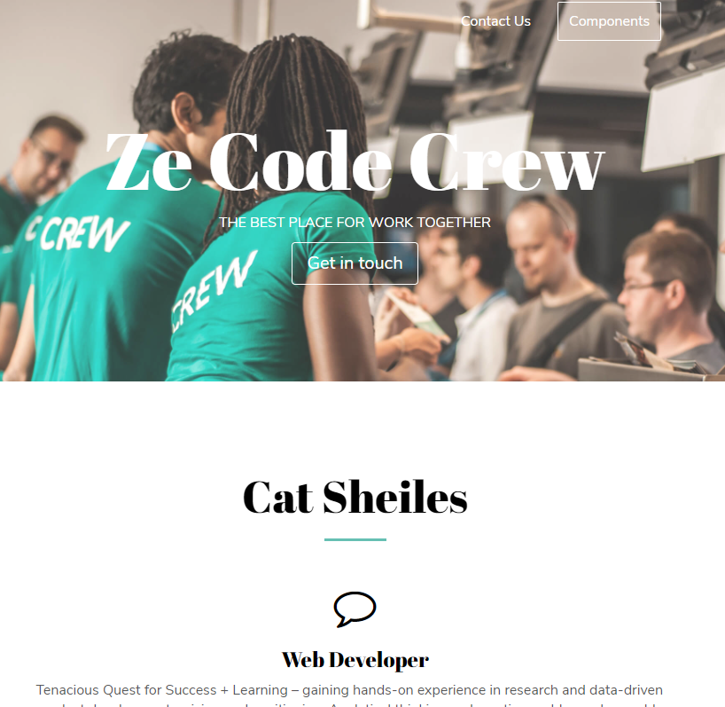

  

<h3 align="center">About Me Landing Page Project</h3>

---

  Deployed to active github-pages via https://catsheiles.github.io/
 
- using MINIFI with all the styling code  
- coded using a base template from Sketch design templates
  

## 🧐 About 

Creating a landing page project to deploy as a base for github website.

## 🏁 Getting Started 
Snapshot of page layout.

---

## 🎈 Usage 

Add notes about how to use the system - work in progress to be completed.

## 🚀 Deployment 

Deployed via github pages - test sample site, links to newsletters and signup pages are inactive.

## ⛏️ Built Using 

- [NodeJs](https://nodejs.org/en/) - Server Environment

## ✍️ Authors 

- [@CatSheiles](https://github.com/CatSheileso) - Idea & Initial work

See also the list of [contributors](https://github.com/kylelobo/The-Documentation-Compendium/contributors) who participated in this project.

## 🎉 Acknowledgements 

- Hat tip to anyone whose code was used
- Inspiration
- References
