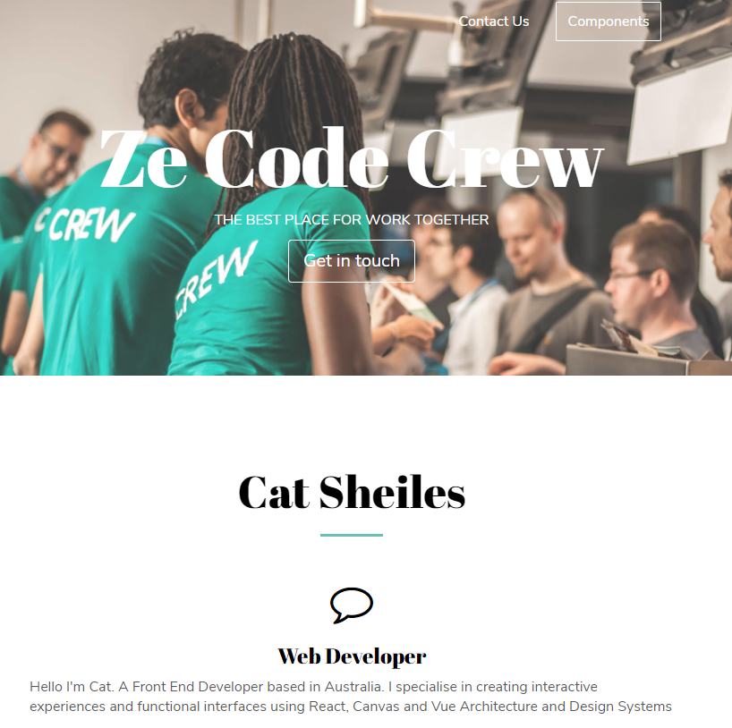

Project to make a 'about me' webpage
-----
- deployed to active github-pages via https://catsheiles.github.io/
- using MINIFI with all the styling code
- using a base template from Sketch design templates

- components.html has a base starter template to begin a new client project.
- great base to constantly change, update and play around and work with html code.

